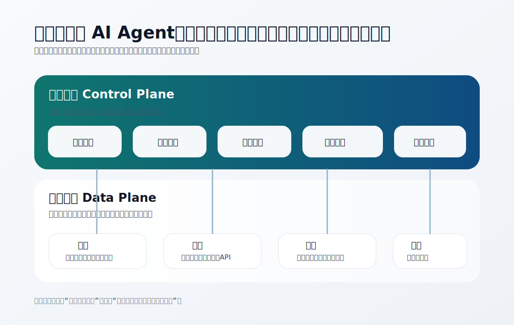
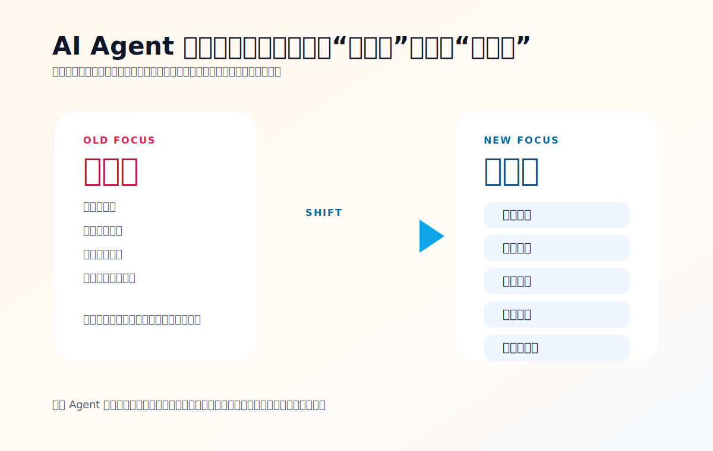

+++
title = 'AI Agent 的下一场竞争，不是更聪明，而是更像控制平面'
slug = 'ai-agent-control-plane'
date = 2026-03-17T11:10:00+08:00
draft = false
tags = ['AI Agent', 'Control Plane', '系统设计', '趋势观察']
categories = ['AI', 'Software Architecture']
summary = '当模型能力逐渐变成公共底座，AI Agent 真正的差异化开始从“回答质量”转向“控制能力”：谁能路由任务、管理权限、维持状态、观测执行、及时回滚，谁就更接近下一代 Agent 平台。'
toc = true
math = false
+++

这一年我们讨论 AI Agent，最容易掉进一个旧框架：还是拿它当“更主动一点的聊天机器人”。

于是大家比较的东西也很熟悉：

- 谁的模型更强
- 谁的回答更自然
- 谁的长上下文更能装
- 谁的工具调用看起来更自动

这些当然重要，但我越来越觉得，它们正在慢慢变成基础分，而不是决定胜负的关键。

真正会拉开差距的，正在变成另一层东西：**控制平面。**

## 什么叫“控制平面”

这个词原本更常出现在云计算和基础设施里。简单说，数据平面负责“干活”，控制平面负责“决定怎么干、谁来干、什么时候停、出了问题怎么办”。

把这个概念放到 AI Agent 上，就很有意思了。

模型本身更像数据平面的一部分。它负责生成、推理、理解、调用。但如果系统里只有模型，而没有控制平面，那整个 Agent 仍然很像一个高性能但不稳定的发动机：

- 能转，但不一定转得对
- 能执行，但不一定知道边界
- 能持续输出，但不一定知道什么时候该停

所以未来 Agent 的核心能力，很可能不是“再多一个超级模型”，而是围绕模型建起一层真正可治理的运行系统。

*图：控制平面不直接“干活”，但它决定任务如何分发、权限如何收口、状态如何维持，以及系统出错时能否及时止损。*

## 为什么这个变化会现在发生

因为模型正在快速商品化。

过去几年，最稀缺的东西是“可用的大模型能力”。谁能拿到更强的模型，谁就更容易形成代差。

但到今天，模型已经越来越像通用底座。选择变多了，能力差距还在，但没有以前那么绝对了。于是整个行业自然会往上游迁移竞争点：

- 单次回答，变成长期协作
- 单工具调用，变成多系统编排
- 单轮生成，变成持续执行
- 单模型能力，变成系统治理能力

这也是为什么最近很多值得关注的 Agent 项目，重点都不是“回答像不像人”，而是“执行像不像系统”。

## 一个成熟 Agent 的竞争力，可能会落在五件事上

### 第一，任务路由

不是所有问题都该交给同一个模型、同一种工具、同一套流程。

一个成熟的 Agent 系统，首先得知道怎么分发任务：

- 什么是需要立即回答的问题
- 什么是需要调外部工具的问题
- 什么是需要人确认的问题
- 什么是应该异步继续推进的问题

如果没有路由层，Agent 再聪明，也只是把所有问题都塞给同一个大脑硬解。

那种系统短期看很炫，长期看很脆。

### 第二，权限模型

工具接得越多，风险就越高。

一个只能聊天的 AI，最多是“答错”。一个能发消息、读文件、跑命令、改数据的 Agent，问题就不是答错，而是**做错**。

所以权限一定会成为主战场。未来大家不会只问“它能连什么工具”，而会问：

- 哪些工具默认可用
- 哪些动作必须审批
- 哪些来源可以触发执行
- 哪些上下文可以被访问
- 哪些操作可以追溯和撤销

没有权限模型的 Agent，不是强，而是危险。

### 第三，状态管理

很多 Agent 失败，不是因为模型推理失败，而是因为状态丢了。

它忘了你上一轮为什么做这个任务，忘了这一步已经执行到哪，忘了哪个结论是暂存、哪个结论是已确认，最后就会出现一种很熟悉的体验：

它每一轮都像刚睡醒。

真正可用的 Agent，一定要把状态当作产品主体，而不是“顺便记一点聊天记录”。因为一旦进入真实工作流，系统面对的就不再是一个 Prompt，而是一段持续演化的任务过程。

### 第四，可观测性

Agent 为什么很难让人放心？因为它常常做了很多事，但你看不见它是怎么做的。

未来成熟产品一定会越来越重视可观测性：

- 它刚刚调了什么工具
- 为什么做出这个判断
- 当前执行停在哪一步
- 失败发生在哪个环节
- 下一步准备做什么

这不是为了给系统加“解释性装饰”，而是为了让人类能接管、能审计、能 debug。

没有可观测性，Agent 就很像一个永远不写工单备注、但又总说自己已经处理过的同事。

### 第五，回滚能力

大家现在很爱展示 Agent 的自动执行，但我反而觉得，未来更珍贵的能力是“撤销”和“止损”。

因为真实世界里最难的，从来不是让系统动起来，而是：

- 动错了怎么办
- 动一半失败了怎么办
- 多步流程中途出错怎么办
- 外部系统状态已经改变怎么办

如果没有回滚、补偿和人为接管机制，所谓“自动化”很容易变成扩大事故半径的放大器。

所以我判断，下一代 Agent 产品最终比拼的，不会只是自动执行率，而是**可控执行率**。

## 为什么我会说它越来越像“控制平面”

因为这些能力合在一起，本质上都不是模型在做“内容生成”，而是在做“系统治理”。

你会发现，未来一个优秀的 Agent 平台，最重要的卖点可能不再是：

- 回答多像人
- 文案多流畅
- 对话多自然

而会变成：

- 任务怎么被分流
- 权限怎么被收口
- 状态怎么被维持
- 执行怎么被观察
- 风险怎么被限制

这套东西，听上去越来越不像一个聊天产品，反而越来越像一层运行基础设施。

也正因为如此，我觉得 AI Agent 的竞争会越来越接近云时代的平台竞争逻辑：**底层能力很重要，但真正形成护城河的是调度、治理和运行质量。**

*图：未来 Agent 的差异化，会逐渐从“更聪明的回答”转向“更可控的运行”。*

## OpenClaw 只是一个开始信号

我最近之所以重新关注 `OpenClaw`，并不是因为它证明了“未来已经到了”，而是因为它把这个方向表达得足够明显。

当一个 Agent 项目开始认真处理本地运行、来源校验、配对机制、执行审批和安全边界时，它实际上已经告诉我们：行业焦点正在从“你能不能做点什么”转向“你做事时能不能被控制”。

这不是热度话题，而是阶段切换。

## 结语

未来大家回头看这一阶段，可能会发现一个很有意思的变化：

我们曾经以为 AI Agent 的核心问题是“怎么让它更聪明”，后来才意识到，真正难的问题其实是“怎么让它在聪明的同时，仍然保持可管理”。

谁先把这件事做对，谁就更接近下一代 Agent 平台。
