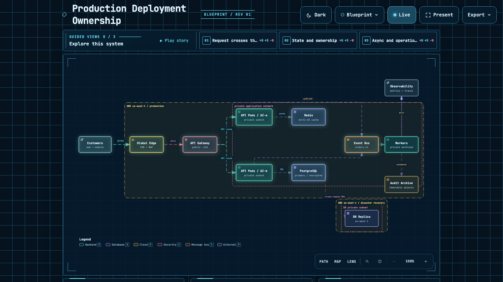
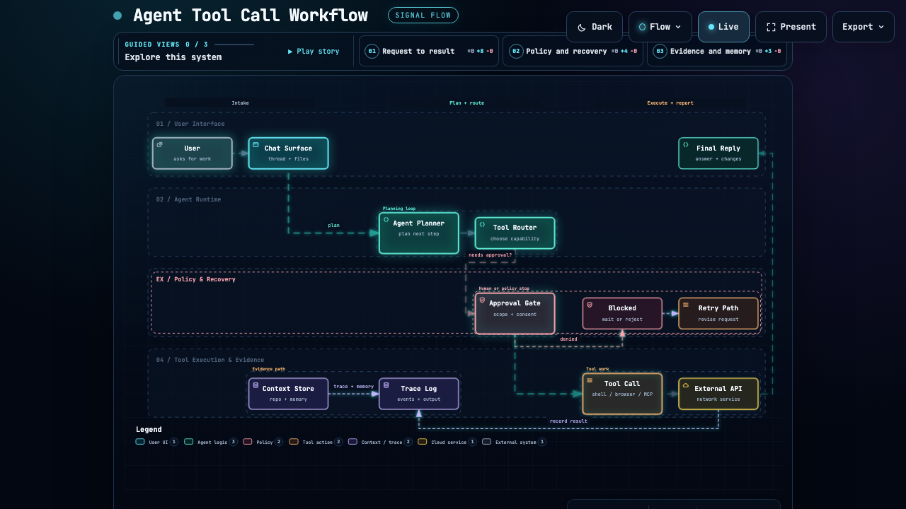
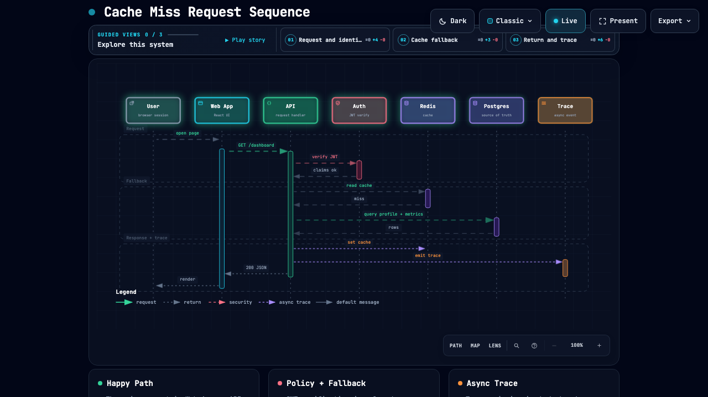
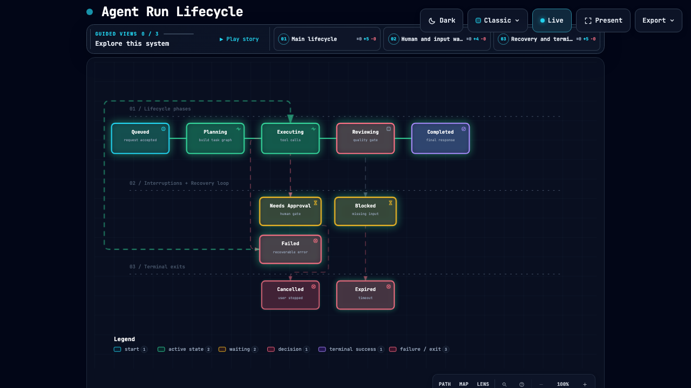

+++
title = 'Archify：当 AI 生成架构图不再靠碰运气，而是走向确定性编译'
slug = 'archify-deterministic-architecture-diagram-agent'
date = 2026-09-12T11:35:00+08:00
draft = false
tags = ['Archify', 'AI Coding', 'AI Agent', '架构设计', '开源', '系统设计', '开发工具']
categories = ['AI Tools', '开源']
summary = '每次让 Coding Agent 画架构图都是一场碰运气的赌博：Mermaid 语法动辄幻觉爆错，连线缠绕成乱麻，手写 SVG 更是车祸现场。Archify 换了条颠覆性的路子——模型只负责吐出强类型 JSON IR，编译器负责严苛的几何与物理避让，最终交付带搜索、路由探测、影响面分析与 Diff 对比的自包含交互式活图。'
toc = true
math = false
+++

如果你经常用 Claude Code、Codex CLI、Cursor 或者 OpenCode 写代码，大概率经历过这种折磨：

让 Agent 帮你梳理当前项目的模块依赖，或者为新方案画一张系统架构图。

接下来发生的事情通常只有两种结局：

第一种，它吐出了一段看似像样的 Mermaid 代码。你满怀期待地把它丢进渲染器，要么因为模型自造了奇怪语法直接抛错；要么侥幸渲染出来了，却发现所有箭头密密麻麻交叉缠绕在一起，像一团被猫玩乱的毛线球，既看不清主干，也理不清边界。

第二种，它试图用纯 HTML/SVG 手搓。结果十有八九是尺寸溢出、文字重叠、走线生硬，毫无工程质感可言。

最要命的是，哪怕勉强画出了一张静态图片，它也是**死的**。你无法在图上搜索某个微服务，无法点击某个节点看它的上下游影响面，无法追溯某条具体的调用链路，更无法在代码重构或 PR 合并前，像比对代码一样比对架构的 `Before` 和 `After`。

在代码生成、单元测试、错误修复都已经迈向工业级精度的今天，**系统架构与可视化却依然停留在“大模型画画碰运气”的石器时代。**

最近在开源社区蹿红的 `Archify`（已经揽获 5.8 万+ Star），给出了一个极其硬核的工程答案。

它没有顺着“让大模型多学点绘图语法”的老路走，而是彻底换了底层范式：**大模型只负责推理语义拓扑并输出强类型 JSON IR（中间表示），确定性编译器负责严密的物理几何布局与合规校验，最终交付成零运行时依赖、内嵌丰富交互能力的自包含 HTML。**

官方的那句定位一针见血：

> Turn a codebase or system description into a polished, interactive system map — directly in chat.

## 它到底是什么

Archify 表面上是一个 Agent Skill（支持 Cursor、Claude Code、Codex、OpenCode、DeepSeek Harness 等）。但往深处看，它实际上是一套**面向 AI Coding Agent 的确定性制图编译器与验证系统**。

传统制图工具和 Archify 的工作链路，有着本质上的分水岭：

```text
传统方式（脆弱且失控）：
用户描述 / 代码库 ──► LLM 一步到位猜语法/坐标 ──► 破损的 Mermaid / 凌乱的 SVG ──► 静态死图

Archify 方式（确定性解耦与校验闭环）：
用户描述 / 代码库 
       │
       ▼
 语义与事实抽象（LLM 强项）
       │
       ▼
 强类型 JSON IR（节点角色 / 关系 / 协议 / 边界）
       │
       ▼
 Archify 确定性编译器（物理排版 / 端口分散 / 标签避让）
       │
       ▼
 交付校验网关（validate ──► deliver ──► visual-check）
       │
       ▼
 单文件自包含 HTML / SVG（带搜索 / 路由探测 / 语义透镜 / 故事导览）
```

很多工具之所以糟糕，是因为它们把两件完全冲突的事混在了一起：**理解系统架构（语义层）** 和 **计算像素坐标与走线（几何层）**。

大语言模型拥有强大的逻辑推理能力，能准确提取出“A 通过 gRPC 调用 B，B 异步推送到 Kafka”，但它天生就不擅长精确计算“节点 A 应该落在坐标 (240, 180)，连线拐角应该留出 16px 半径以防遮挡文本”。

Archify 的核心主张非常清醒：**让模型做模型的强项，让编译器做编译器的强项。**

模型只需要老老实实生成符合 JSON Schema 的拓扑事实（JSON IR），几何摆放、边缘防撞、端口分散、样式主题和交互脚本全部交给 Archify 的编译管线来裁决。

## 撕开表象：三大核心设计哲学

为什么 Archify 生成的图不仅视觉精致，而且“经得起推敲”？看它的内部规范（`authoring-contract` 与 `renderers`）会发现几个非常值得玩味的设计考量。

### 1. 物理几何法则：彻底消灭连线车祸

自动排版中最令人崩溃的，莫过于连线穿过无关节点、多条连线在同一个端口挤成一团、以及关系标签把线挡得严严实实。

Archify 引入了一套近乎偏执的几何约束：

- **自动端口分散（Automatic Port Spread）**：当多个组件同时连接到同一个服务时，Archify 绝不允许它们在同一个像素点扎堆。编译器会根据相对位置自动在边界上均匀打散端口，相邻平行端口强制采用外侧桥接（outside bridge），坚决消灭小于 8px 的微小线段与小于 16px 的内部锐角急转弯。
- **真实留白与标签保护（Clear Gap）**：在 Archify 的定义里，间距不是指节点“中心点到中心点”的几何距离，而是物体边缘之间的**净空间距（Clear Gap）**。任何连线上的协议标签，都必须严格大于其渲染遮罩的包围盒，严禁标签遮挡其他走线。
- **零穿透原则**：如果一条有向边穿过了一个不透明的无关节点，或者两条走线共用了一条模棱两可的走廊，编译器在 `validate` 阶段会直接拒收报错，要求重新规划路径，绝不把垃圾布局端给读者。

```text
常见布局引擎的窘境：
[ Client ] ───────┐
[ Mobile ] ───────┼───► [ Service ]  (多线扎堆、交叉重叠)
[ Third  ] ───────┘

Archify 的物理端口分散：
[ Client ] ───────────────┐
                          ├─► [ Port 1 ]
[ Mobile ] ───────────────┼─► [ Port 2 ]  [ Service ]
                          │
[ Third  ] ─┐             ├─► [ Port 3 ]
            └─(bridge)────┘
```

这种确定性的几何规约，使得无论你的系统规模多大多密，渲染出来的线条始终如印刷电路板一般清晰规整。

### 2. 拒绝死图：架构图必须是“活的”可探索系统

软件工程中的架构图从来不是挂在墙上的装饰画，它是用来**回答工程疑问**的。

Archify 编译出来的并不是一张截图，而是一个自包含的交互空间，开箱自带一整套系统探查武器：

- **最短路由探测（Route Probe）**：在微服务架构里，你想知道“Web 端的一次点击究竟经过哪些跳步才会触达数据库”？不需要肉眼顺着箭头找，直接点击起点和终点，系统会自动高亮最短有向路径，将无关噪声瞬间淡化。
- **上下游辐射范围（Reach Analysis）**：改动这个消息网关会波及谁？点击网关并触发 `Downstream Reach`，所有依赖它的下游组件一目了然；反之，查看 `Upstream Reach` 则能迅速回溯故障源头。
- **语义透镜（Semantic Lens）**：根据节点类型（前端、后端、数据库、外部云厂商、安全边界）进行角色切片。一键隐藏业务细节，专门审视“所有后端与数据存储之间的流量关系”。
- **引导式故事（Guided Stories / Named Views）**：一张大图往往信息过载。Archify 允许作者在 metadata 中定义最多 5 个具名故事章节（例如“常规读取流程”、“降级容灾链路”、“冷热数据同步”）。读者就像看幻灯片一样，按章节切换视图，聚焦特定上下文。
- **架构版本比对（Architecture Diff）**：这是 Archify 最惊艳的能力之一。针对系统演进，它可以比对两个快照，直接生成 `Before / Delta / After` 视图，用红绿增量明确标出：哪些服务是新增的、哪些接口被废弃、哪些走线被重定向。架构评审（RFC）再也不用肉眼找不同。

```text
           [ Route Probe: Client ──► Cache ──► DB ]
┌──────────┐         ┌──────────┐         ┌──────────┐
│  Client  │ ══════► │  Cache   │ ══════► │    DB    │  (高亮核心链路)
└──────────┘         └──────────┘         └──────────┘
      │                   │                     ▲
      : (淡化)            : (淡化)              │ (淡化)
┌──────────┐         ┌──────────┐               │
│ Analytics│ · · · · │ Message  │ · · · · · · · ┘
└──────────┘         └──────────┘
```

### 3. 交付契约（Delivery Contract）与零运行时依赖

许多前端图表库极度依赖庞大的外部 CDN、React/Vue 运行时或在线服务。断网不能看，客户内网打不开，几年后 CDN 域名失效更是一场灾难。

Archify 生成的产物，具有严苛的工程自洽性：

1. **单文件自包含（Zero Runtime Dependency）**：所有的 CSS、矢量图标、暗黑/明亮主题切换逻辑、平移缩放（Pan/Zoom）、甚至内置的常用技术栈 Brand Logo，全部内联封装进同一个 `.html`。体积小巧，离线可读，任何浏览器双击即开。
2. **三权分立的校验回执（Delivery Contract）**：
   - `validate`：编译器检查类型、几何间距、拓扑连通性。
   - `deliver`：把当前规范版本原子化冻结，生成规范文件与 HTML 制品的 SHA-256 哈希回执与字节数，确保可溯源。
   - `visual-check`：自动调用真实无头浏览器加载该页面，验证在真实视口下的渲染表现并抓取基准截图，与人类主观视觉评审独立分开。
3. **高保真卡片导出（Share Cards）**：支持一键导出符合 OpenGraph 标准的 1200×630 分享卡片、SVG 矢量切片、无损 PNG 以及演示专用的短动效。放在 README、PR 描述或技术方案文档中，观感极度舒适。

## 实战成果：Archify 生成的 4 类工业级成品图

光讲原理不够过瘾。我安装了 Archify 技能，并让它针对我们真实的工程场景，直接编译输出了 4 种最核心的图表类型。

看这些实际渲染生成的成品图，你就能明白它与传统 AI 绘图的云泥之别：

### 1. 系统架构图 (`architecture`)：生产级多层部署拓扑


*Archify 编译的云端多层架构：包含 AWS Region 边界隔离、安全组（sg-api）网络切片、负载均衡、API 实例集群、PostgreSQL、Redis 缓存、SQS 任务队列与异步 Worker。*
> **可交互原型**：<a href="/artifacts/archify/production-architecture.html" target="_blank" rel="noopener noreferrer">在新标签页打开自包含交互式 HTML ↗</a>

注意看图中的几个关键工程细节：
- **边界划分极其干净**：`AWS Region: us-west-2` 与 `sg-api` 的嵌套虚线框层级分明，组件自动对齐；
- **端口分散与桥接**：API Server 同时连着 Auth Provider、Redis、PostgreSQL 和 SQS，4 条连线在边界上均匀打散，完全没有出现传统制图中“多根线挤进同一个像素拐点”的事故；
- **自包含控制台**：顶部自带 3 个预设故事（`Primary request path`、`Identity and cache`、`Static and async work`），底部提供角色切片图例（Backend 2、Database 2、Cloud 3 等）。

### 2. 工作流图 (`workflow`)：AI Agent 工具调用与异常恢复决策


*AI Coding Agent 的核心调度循环：从用户输入、Planner 规划、Tool Router 路由，到安全策略门禁（Approval Gate）、异常拦截与重试恢复分支。*
> **可交互原型**：<a href="/artifacts/archify/agent-tool-call-workflow.html" target="_blank" rel="noopener noreferrer">在新标签页打开自包含交互式 HTML ↗</a>

在 `Signal Flow` 预设下，整个流程图呈现出极具动感的流线设计：
- **分层泳道（Lanes）**：清晰划分出 `01 / User Interface`、`02 / Agent Runtime`、`EX / Policy & Recovery` 和 `04 / Tool Execution`；
- **异常回环与阻断**：当工具调用触发人工审批门禁被拒绝时，红色的 `denied` 连线平滑接入 `Blocked` 状态，并引出 `Retry Path` 修正请求重新规划，逻辑分支极为直观。

### 3. 调用时序图 (`sequence`)：缓存未命中与鉴权链路


*微服务请求时序：包含用户发起请求、JWT 鉴权、Redis 缓存探测、未命中时回退查库、反写缓存以及异步发送 Trace 埋点。*
> **可交互原型**：<a href="/artifacts/archify/cache-miss-sequence.html" target="_blank" rel="noopener noreferrer">在新标签页打开自包含交互式 HTML ↗</a>

做过分布式系统的同学都知道，画时序图最头疼的是“异步事件”和“激活生命周期条（Activation Bars）”错位。
在 Archify 生成的时序图中：
- 垂直生命周期条根据同步调用的起止自动拉伸，严格对应生命周期；
- 同步 HTTP 请求（实线箭头）、JWT 鉴权（红色高亮）、数据库查询与行数据返回（虚线箭头）、以及异步上报 Trace（紫色独立箭头）有着严格的色彩与线型区分；
- 顶部同样自带时序分步演播控制（`Request and identity` ➔ `Cache fallback` ➔ `Return and trace`）。

### 4. 状态生命周期图 (`lifecycle`)：Agent 运行时状态机


*Agent 状态转移图：覆盖主生命周期（Queued ➔ Planning ➔ Executing ➔ Reviewing ➔ Completed），以及中断审批、等待输入、错误重试与超时销毁终态。*
> **可交互原型**：<a href="/artifacts/archify/agent-run-lifecycle.html" target="_blank" rel="noopener noreferrer">在新标签页打开自包含交互式 HTML ↗</a>

面对复杂的有限状态机（FSM），Archify 表现出了教科书级别的状态转移约束：
- 正常主链路保持水平主干排列，视觉重心明确；
- 可恢复错误（`Failed`）采用平滑环路折回 `Queued`，不可逆终态（`Cancelled`、`Expired`）规整下沉到终端退出区；
- 底部图例自动标注不同状态语义（起始状态、活跃状态、等待状态、决策分支、终态成功与失败退出）。

## 五种图表类型与四种工业级预设速查

通过上面的实物对比，我们可以归纳出 Archify 针对工程制图的 5 种专门模型：

| 图表类型 (`type`) | 核心关注点 | 典型应用场景 |
| :--- | :--- | :--- |
| **`architecture`** | 系统拓扑、网络分区、服务角色、安全边界 | 微服务部署图、云基础设施、DDD 领域架构 |
| **`workflow`** | 状态转移条件、人工/自动审批、多分支合并 | 业务审批流、CI/CD 交付流水线、Agent 决策树 |
| **`sequence`** | 参与者生命周期、同步/异步调用、消息返回 | 鉴权认证时序、分布式事务协议、支付回调闭环 |
| **`data-flow`** | 数据流向、ETL 转换节点、处理吞吐与存储 | 数据湖加工管道、实时流计算、事件驱动中继 |
| **`lifecycle`** | 实体状态机、触发事件、合法与非法跃迁 | 订单生命周期、连接池状态、虚拟机实例流转 |

在视觉风格上，Archify 摈弃了 AI 绘图常见的廉价渐变毛玻璃，提供了 4 套沉稳扎实的专业工程预设：

- **`Signal Flow`**：强调流动感与数据流速，适合分布式系统与高吞吐网络；
- **`Blueprint`**：经典工程蓝图风格，网格底纹配严密标注，工程严谨感拉满；
- **`Classic`**：克制的高对比度现代设计系统，适合官方文档与技术白皮书；
- **`Editorial`**：杂志级版式排版与优雅衬线点缀，专为公开演讲、技术博客与产品发布会打造。

配合一键切换的 Dark / Light 主题，无论嵌在深色终端文档还是浅色 Notion 知识库中，都毫无违和感。

## 如何在日常开发中使用

得益于 Agent Skills 生态的成熟，安装和使用 Archify 没有任何复杂的配环境过程：

### 1. 安装 Skill

全局安装只需一条命令：

```bash
npx skills add tt-a1i/archify -g
```

如果你使用的是 Cursor，可以直接指定非交互式安装：

```bash
npx -y skills add tt-a1i/archify --skill archify --agent cursor --global --copy --yes
```

而在 DeepSeek Harness（DSH）中，它也提供了原生的插件支持：

```bash
dsh plugin --profile web add @tt-a1i/archify-dsh@0.1.0
```

安装完成后，可以通过自带的 doctor 进行自检：

```bash
node ~/.agents/skills/archify/bin/archify.mjs doctor
```

### 2. 在对话中直接唤醒

安装完成后，你甚至不需要提前准备规范文件。直接在与 Claude Code、Cursor、Codex 或 Antigravity 的对话框里说人话：

> “分析我们当前仓库中的认证模块和鉴权流程，使用 Archify 生成一张 dark 主题的 sequence 时序图，重点展示 JWT 校验失败与刷新 Token 的分支。”

或者给它一个全新系统的描述：

> “设计一个支持百万并发的实时推送网关架构，包含 Edge Envoy、Auth Service、Redis Cluster、WebSocket Workers 和 Kafka。请用 Archify 的 Blueprint 预设，生成 architecture 架构图，并包含正常下发与容灾重连两个引导章节。”

Agent 会在后台经历：
1. 分析代码事实或用户需求；
2. 构造符合架构契约的 `architecture.json` 强类型 IR；
3. 调用 `node bin/archify.mjs deliver architecture.json output.html` 触发确定性编译；
4. 跑完几何校验与无头浏览器验证，输出最终的自包含 `.html` 文件路径。

你双击打开产物，就是一张具备完整交互能力的工业级系统图。

## 权衡与取舍：它不适合什么？

再惊艳的工具也有边界。理解 Archify 的克制与约束，才能用在合适的地方：

1. **它不是画板工具**：如果你想要的是 Excalidraw 那种随意涂鸦、手绘风格的潦草白板草图，或者 Figma 里天马行空的自由插画，Archify 会让你感到“被束缚”。它的每个节点位置、每条连线拐点都受到编译规则的严格约束。
2. **严苛校验带来的报错成本**：Archify 的编译器不是宽容的。如果你的拓扑定义中出现了连线交叉遮挡、不可达死端、或是端口冲突，校验阶段会毫不客气地抛出 Diagnostic 警告或阻断。这意味着 Agent 在生成复杂拓扑时，偶尔需要进行一到两轮的“几何修复重试”。
3. **重点在于系统理解而非像素微调**：Archify 鼓励你表达“A 与 B 之间的语义关系是什么”，而不是“请把这个框往左挪 3.5 像素”。试图去微操像素，反而违背了它的设计初衷。

## 总结：从“碰运气的图”走向“可信赖的系统资产”

回顾近几年 AI 编程助手的发展，我们经历了一个明显的阶段跃迁：

从最初“生成一段无法运行的代码草稿，靠程序员肉眼人肉排错”；到后来引入语言服务器（LSP）、类型检查器（Typechecker）、单测沙箱与自动修复循环，代码生成终于变成了**确定性工程**。

但可视化这一侧，长期以来却被遗忘在了蛮荒之地。我们忍受着残缺的 Mermaid、丑陋的自动排版和毫无交互能力的死位图，误以为“AI 绘图大概也就只能这样了”。

Archify 的出现撕开了这个偏见。

它证明了一件事：**在 AI 时代，技术制图同样可以被编译化、结构化、契约化。**

大模型负责提供洞察与语义，编译器负责捍卫美学与物理法则，交付契约负责保障可靠与确定性。当生成的架构图变成可以搜索、可以探查、可以版本比对的自包含系统资产时，系统设计才真正成为了现代 AI 辅助研发闭环中坚实的一环。

如果你已经厌倦了在聊天框里跟 Mermaid 的乱麻连线搏斗，不妨给你的 Agent 装上 Archify 试一试。那种一次性编译出优雅、严密、可探索的系统全景图的体验，会让你彻底告别过去的妥协。

## 相关链接

- **GitHub 仓库**：[tt-a1i/archify](https://github.com/tt-a1i/archify)
- **项目官方主页**：[https://tt-a1i.github.io/archify/](https://tt-a1i.github.io/archify/)
- **可交互案例展厅（Proof Lab）**：[https://tt-a1i.github.io/archify/gallery.html](https://tt-a1i.github.io/archify/gallery.html)
- **场景选型指南**：[https://tt-a1i.github.io/archify/guide.html](https://tt-a1i.github.io/archify/guide.html)
