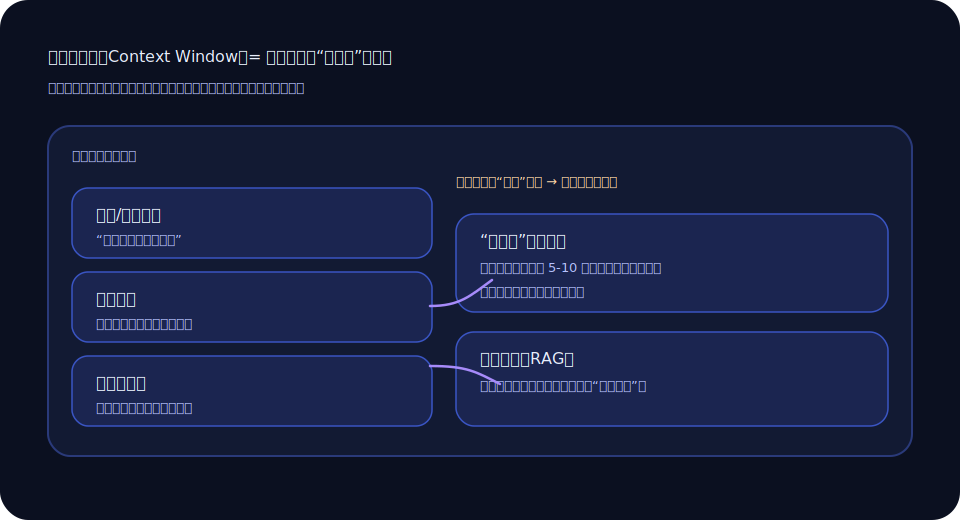

+++
title = '上下文窗口这事儿：我怎么让大模型“别忘太快”'
slug = 'llm-context-window'
date = 2025-09-12T10:05:00+08:00
draft = false
tags = ['大模型', '上下文', '提示词', '工程']
categories = ['大模型']
summary = '我以前总以为模型“记性差”，后来才发现：很多遗忘是我自己喂的内容太乱。'
toc = true
math = false
+++

我第一次被“上下文窗口”这件事教育，是在一个很日常的场景：我让模型帮我写一个发布说明。我们聊得挺顺，它也挺配合。聊到第七八轮的时候，它突然把前面确定过的规则忘了个干净，像你在群里说了三次“不要发外链”，结果还是有人发。

那一刻我很想怪它：“你怎么这么健忘？”  
后来我回看对话记录，发现更像是我自己把它推下水的——我不断往里面塞碎片信息，没做任何整理，最后连我自己都很难在一屏里找到关键约束。

## 上下文窗口到底在装什么

简单说，它装的是“这一刻你给它看的东西”。不只是你当前这一句，还包括：

- 系统/角色指令（如果有）
- 之前的对话历史
- 你贴进去的资料（文档片段、代码、邮件）
- 工具返回的内容（如果你接了检索/函数调用）

当这些东西挤在一个盒子里，盒子满了就得“丢东西”。丢哪部分、丢多少，不一定符合人类的直觉。

下面这张图，是我后来用来跟同事解释的“盒子视角”：

## 我后来用的一个笨办法：把“重要信息”变成一张小卡片

我不再让关键规则散落在对话的各个角落。每当我们确认了一条重要约束，我会立刻做一件很土的事：把它汇总成一张“约束卡”，后续每次请求都附上。

比如：

- 目标受众：内部研发
- 语气：简洁、不要营销腔
- 必须包含：变更点 / 风险点 / 回滚方式
- 禁止：夸大、绝对化承诺

这张卡不需要很长，10 行以内就行。它不是为了“更聪明”，它是为了“更稳定”。

## 另一件很关键的事：别把“聊天记录”当成“知识库”

我见过很多人把长文档直接贴进对话里，然后期待模型在后面 30 轮都记得住。现实是：你越贴越多，它越容易把“真正该记的”淹没在噪音里。

如果你有检索能力（RAG），最好把文档放在知识库里，**每次只把相关片段检索出来**。你要的是“每次都拿到关键材料”，不是“把所有材料塞进嘴里”。

## 我最喜欢的提示方式：先要“提问清单”

当我发现对话开始变长、规则开始摇摆时，我会暂停一下，问模型一句：

> 如果我们要把这件事做对，你觉得还缺哪些信息？请列出 5 个你最想问的问题。

这句非常有用。它会暴露出你没交代的前提，也会把对话从“越聊越散”拉回“缺什么补什么”。

## 一点现实：窗口变大不等于体验变好

更长的上下文窗口当然有帮助，但它不是万能药。盒子变大了，噪音也会一起变大。真正让体验变好的，往往还是两件事：

- 你输入的结构更清晰
- 你把“长期信息”从对话里抽出来（写成约束卡 / 放进知识库）

我现在把上下文窗口当成一张桌子：桌子大一点当然好，但桌面上如果堆满杂物，你还是找不到钥匙。

