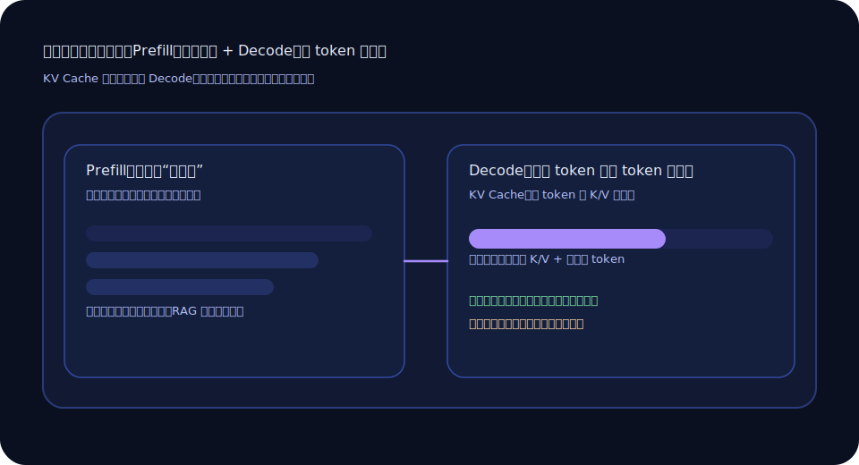

+++
title = '同一句话第二次更快：我终于把 KV Cache 想明白了'
slug = 'llm-kv-cache'
date = 2025-10-22T20:18:00+08:00
draft = false
tags = ['大模型', '推理', '性能', 'KV Cache']
categories = ['大模型']
summary = 'KV Cache 听起来像黑魔法，其实它更像“你翻过的页不需要再翻一次”。'
toc = true
math = false
+++

我第一次注意到 KV Cache，是因为一个“很像玄学”的现象：同样的 prompt，第一次生成很慢，第二次就快很多。  
我当时的直觉是：是不是机器“热起来了”？是不是网络抖了一下？

后来我才知道，这背后其实是一个非常朴素的道理：**模型不想重复做已经做过的计算。**

## 先说人话版：KV Cache 像书签

你读一本书，翻到第 100 页，做了一堆理解、联想、标注。下一次你继续从第 100 页往后读，你当然不会把前 99 页再读一遍。

KV Cache 就有点像那个“书签 + 已读笔记”。它把“前面这段上下文的注意力计算结果”存起来，后面每生成一个新 token，就不用把旧内容重新算一遍。

下面这张图是我最喜欢的解释：把生成过程拆成 **prefill**（把输入读完）和 **decode**（一个字一个字往外吐）：

## 为什么它跟“长上下文”关系很大

你上下文越长，prefill 就越贵。  
如果你每次都把一个很长的对话历史塞进去，模型每次都要把它“读一遍”，你就会觉得它慢得像在搬砖。

KV Cache 的好处在于：如果你的服务端支持复用（或者你在一个会话里连续生成），后续 token 的成本会稳定很多。

但这也带来另一个现实：**缓存要占显存。**  
所以你会看到一些服务在并发变高时突然变慢，或者需要做“会话切分/清理策略”。它不是突然变笨了，它是显存被塞满了。

## 我踩过的一个坑：我以为“缓存 = 永久”

KV Cache 并不是一种“你永远能拿回来”的东西。很多推理框架会在：

- 会话结束
- 超时
- 内存压力

的时候清掉缓存。所以你如果把它当成“长期记忆”，一定会失望。

我的经验是：KV Cache 更像“短期加速”，而“长期记忆”应该交给：

- 结构化摘要（把长对话压缩成约束卡）
- 检索（RAG，把资料放到外部）

## 你可以怎么用它（非常实用版）

如果你在做产品/服务，我建议你盯三件事：

1) **尽量减少重复的超长输入**：能摘要就摘要，能检索就检索。
2) **把对话分成会话**：别让一个会话无止境增长（尤其是客服场景）。
3) **监控显存与首 token 延迟**：用户最讨厌的不是“慢”，是“等半天没动静”。

KV Cache 没有那么神秘。它只是用空间换时间。  
懂了这一点，你就会更愿意在输入结构上做减法：少塞一点垃圾，缓存就能发挥更稳定的价值。

