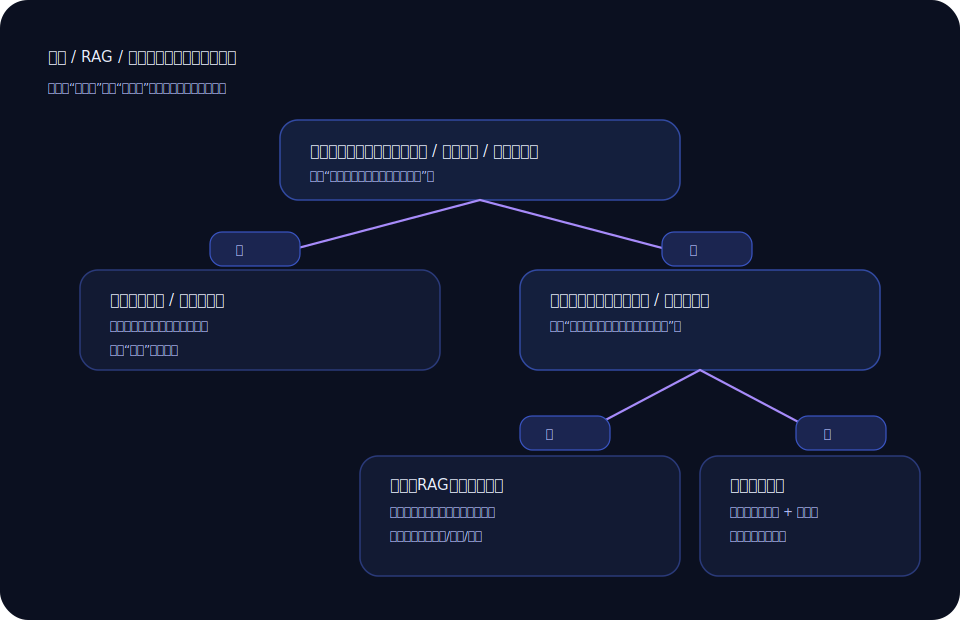

+++
title = '微调？RAG？还是提示词？我用一张“决策树”把自己救了'
slug = 'llm-finetune-rag-prompt'
date = 2025-11-06T09:28:00+08:00
draft = false
tags = ['大模型', '微调', 'RAG', '提示词']
categories = ['大模型']
summary = '别一上来就想着“训练一个更懂我的模型”。很多时候，你缺的不是更聪明的模型，而是更清楚的需求。'
toc = true
math = false
+++

每次团队里有人说“要不我们微调一下”，空气都会突然变得很热闹。  
微调这个词很诱人，像是“我把模型养成我喜欢的样子”。但我做过几次之后，越来越谨慎：微调是大招，别拿来打蚊子。

## 我先问自己三句话

1) 这个问题的核心是“知识缺失”还是“表达习惯”？
2) 我们能不能接受“答案会变动”（随资料更新）？
3) 我们有多少可用的数据、以及验证数据？

问完这三句，通常就能把选择范围缩小很多。

下面这张决策树，是我写在便签上的版本（真的救过我）：

## 一个非常实用的对照：三种方案各自擅长什么

我给你一个很粗糙但够用的对照表：

你会发现：

- **RAG** 擅长“把最新资料带进来”，适合政策、产品手册、内部文档这种会变化的东西。
- **提示词/结构化约束** 擅长“让输出像你想要的样子”，比如格式、语气、步骤化。
- **微调** 更适合“稳定的风格/技能”，比如特定领域的写作风格、固定的分类任务、或者让模型更遵守某种答题方式。

## 我踩过一次典型坑：把“资料问题”当成“训练问题”

我们有一堆内部文档，很多是更新频繁的。有人建议微调，我当时也心动：训练一个“懂我们业务”的模型多酷。

后来冷静下来想：文档每个月都在变，微调一次就过期一次。你会陷入“训练-过期-再训练”的循环。

那次我们最后做了 RAG + 约束卡：

- 检索只拿相关章节
- 输出必须引用来源（文档名/章节）
- 不确定就说不确定，别乱编

效果反而更稳定，而且维护成本低得多。

## 最后的建议：先用小方案跑通，再决定要不要上大招

如果你正在纠结，我建议你按这个顺序试：

1) 先把提示词写清楚（加上格式、禁忌、自检）
2) 资料会变就上 RAG（先把数据整理干净）
3) 只有当“稳定任务 + 有数据 + 可评测”同时成立，再考虑微调

不是微调不好，是它太有力量，力量就意味着成本。  
你用对了，它是电钻；你用错了，它是把墙打穿的电钻。

