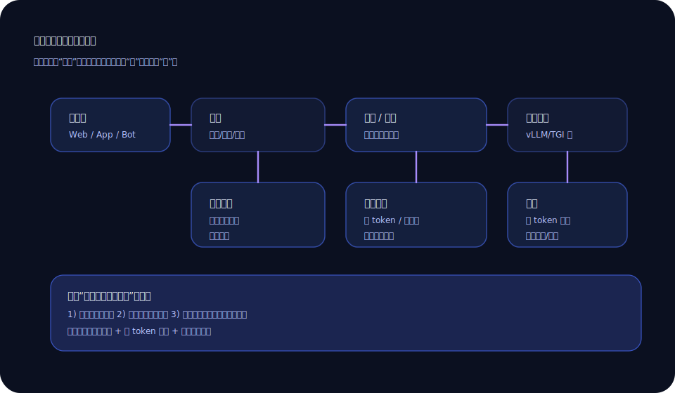

+++
title = '推理服务别只盯模型：我踩坑后总结的三件小事'
slug = 'llm-serving-basics'
date = 2025-11-30T14:06:00+08:00
draft = false
tags = ['大模型', '部署', '推理服务', '工程']
categories = ['大模型']
summary = '用户觉得“模型不稳定”，很多时候是网关、队列、超时策略在暗地里打架。'
toc = true
math = false
+++

我见过很多团队在上线大模型服务时，注意力全放在“选哪个模型、多少参数、要不要量化”。这些当然重要，但我后来发现：  
**真正决定体验的，往往是模型外面那圈工程细节。**

一次线上事故让我彻底长记性：用户反馈“回答突然变慢、偶尔卡死”。我们第一反应是 GPU 不够。结果排了一圈才发现：网关重试策略 + 推理队列 + 超时设置三者组合在一起，像三个人同时拉一扇门——门不坏也要散架。

## 先给一张“正常链路图”

我用这张图跟同事对齐“请求到底走了哪几站”：

当你把链路画出来，很多问题会变得很直观：到底是“模型慢”，还是“排队慢”，还是“重试导致雪崩”。

## 小事一：限流比扩容更先用

大模型服务很怕“尖峰”。尖峰一来，你扩容不一定跟得上，队列却会瞬间堆起来。队列一堆，用户就开始疯狂刷新；你再加重试，就会像滚雪球。

所以我会优先做两种限流：

- **按用户/按 token 的限流**：别让一个人把整个服务吃光。
- **按并发的限流**：宁愿明确返回“稍后再试”，也别让所有人都卡死在加载圈。

限流听起来冷酷，但它能保护整体体验。

## 小事二：超时不是一个数字，是一组策略

很多人把超时当成一个配置：比如 30 秒。  
但大模型服务里，超时应该拆成几段：

- **首 token 超时**：多少秒内必须有字出来（不然用户就以为挂了）
- **总时长超时**：整次请求最多允许多久
- **队列等待超时**：排队超过多久直接放弃

首 token 超时特别重要。很多时候用户不是不能等，而是不能“等不到任何反馈”。你可以先流式吐出一句“我在整理要点”，也比黑屏强。

## 小事三：重试要谨慎，尤其是“自动重试”

对普通接口来说，重试很常见。对大模型推理来说，自动重试很危险。  
因为一次请求可能消耗大量算力，你重试相当于再付一次钱、再占一次队列。

我的建议是：

- **只对明确的网络失败重试**（比如连接断了）
- **不要对 429/队列拥塞重试**（那是雪上加霜）
- 如果必须重试，**做指数退避**，并把重试次数限制在 1-2 次

## 我最后总结的一句话

推理服务像餐厅：模型是厨师，GPU 是灶台。  
但用户体验往往毁在：门口拥堵、叫号乱、上菜没提示、服务员把单子丢了。

把这三件小事做好——限流、超时、重试——你的“模型体验”会立刻像换了一个人。

