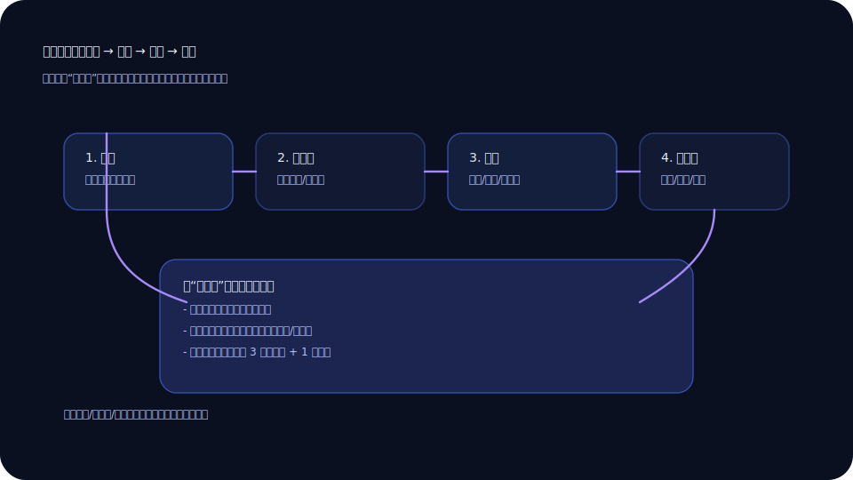
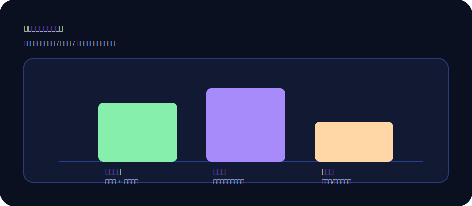

+++
title = '评测大模型别只看榜单：我给它出的 30 道“小考卷”'
slug = 'llm-evaluation-playbook'
date = 2025-12-15T18:22:00+08:00
draft = false
tags = ['大模型', '评测', '可靠性', '产品']
categories = ['大模型']
summary = '榜单像体检报告的平均分，真正重要的是：你的业务里它会在哪些题上失手。'
toc = true
math = false
+++

我以前也爱看榜单：谁第一、谁涨了、谁掉了。  
看多了以后，我开始怀疑：榜单当然有参考价值，但它很像“平均体温”——对个人来说意义有限。

真正让我放心的是一套很土的办法：给模型出一份“小考卷”，题目来自我们真实业务里会踩坑的地方。

## 我的小考卷长什么样

我把题目分成四类：

1) **信息不足**：看它会不会乱编
2) **规则冲突**：看它会不会自洽
3) **边界条件**：看它会不会漏掉异常
4) **引用来源**：看它能不能把“凭感觉”变成“有依据”

我做了一个流程图，把“出题—判卷—回归”串起来：

## 我最喜欢的题型：看它会不会说“不知道”

很多人追求模型“什么都能答”。我反而在意它**能不能识别自己不知道**。  
因为最可怕的不是答错，而是答错还很自信——那会把团队带进坑里。

所以我会故意放几道“信息不足但很像能答”的题，比如：

- “某个接口失败后应该怎么补偿？”（但我不给补偿策略）
- “某个规则的例外是什么？”（但文档里根本没写）

如果模型能问我补充信息，或者明确说“不确定”，那就是好信号。

## 判卷也别太复杂：三档就够

我不用太细的评分体系，三档就够用：

- **可直接用**：答案完整、引用来源、风险点明确
- **可参考**：思路对，但缺少关键细节或验证方式
- **不可用**：乱编、跑题、或者自相矛盾

我把这些结果做成一张简单的“分布图”，方便跟团队对齐（这张图你也可以拿去改成自己的）：

## 评测的意义不是“选最强”，而是“划边界”

做完几轮之后，你会越来越清楚：

- 哪些任务它很稳（比如结构化总结）
- 哪些任务必须有人兜底（比如涉及政策、合规）
- 哪些任务要加约束（比如必须引用来源、必须给验证步骤）

这其实就是在给模型划边界。边界一清楚，你就敢用，也更容易把用法推广给别人。

## 最后一句话

榜单像天赋，小考卷像习惯。  
天赋决定上限，习惯决定你每天会不会翻车。

如果你想让大模型在业务里“稳一点”，我推荐你也给它出一套小考卷。哪怕只有 10 道题，也比盯着排行榜焦虑强太多。

