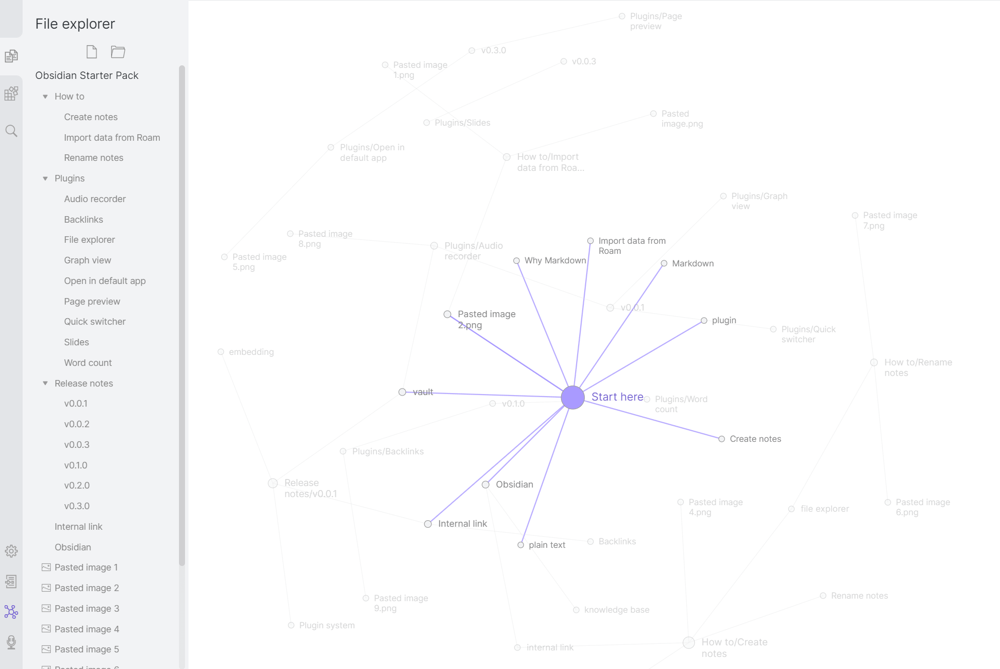

+++
title = 'Obsidian 入门：它不是更漂亮的备忘录，而是一套本地知识库'
slug = 'obsidian-local-first-knowledge-base-guide'
date = 2026-06-07T20:19:00+08:00
draft = false
tags = ['Obsidian', '知识管理', 'Markdown', '写作工具', '效率工具']
categories = ['Tools', '知识管理']
summary = 'Obsidian 最打动我的不是那张很酷的关系图，而是它把笔记重新还原成一堆本地 Markdown 文件，再用链接、反向链接和画布，让这些文件慢慢长成自己的知识库。'
toc = true
math = false
+++

我以前对笔记软件其实有点疲劳。

每隔一段时间，就会冒出一个新的“第二大脑”工具。界面更漂亮，模板更多，数据库更强，协作更顺，最后落到使用者身上，往往变成另一种很熟悉的循环：先花几天搭系统，再花几天调模板，然后真正写进去的东西并不多。

所以一开始看 `Obsidian`，我也没有立刻觉得它有什么特别。

它最出圈的截图通常是那张 Graph View：一堆点，一堆线，像一个人的大脑星图。这个东西很好看，但也很容易误导人。很多人第一次接触 Obsidian，会以为它的核心价值就是把笔记画成一张很酷的关系图。


*Obsidian Graph View 官方截图。它把笔记显示成节点，把笔记之间的内部链接显示成连线。图源：[Obsidian Help - Graph view](https://obsidian.md/help/Plugins/Graph%2Bview)。*

但我现在更愿意反过来说：**Obsidian 最值得关注的地方，不是图谱，而是它把笔记重新还给了文件系统。**

它不像很多云笔记工具那样，把你的内容关在一个在线工作区里。Obsidian 的知识库叫 `Vault`，本质上就是你电脑里的一个文件夹。里面的笔记主要是 Markdown 文件。你可以用 Obsidian 打开它，也可以用 VS Code、Typora、甚至系统自带文本编辑器打开它。

这件事听起来不性感，但对长期写作和知识管理来说，反而很关键。

## Obsidian 到底是什么

如果用一句话介绍，Obsidian 是一个围绕本地 Markdown 文件构建的个人知识库工具。

这句话里有三个关键词。

第一个是**本地**。你的笔记首先存在自己的设备里，而不是默认存在某个云端平台里。它当然也可以同步，也可以发布成网站，但这些是额外能力，不是它的基础前提。

第二个是 **Markdown**。这意味着笔记不是某个私有格式，而是普通文本文件。标题、列表、引用、代码块、链接，这些东西都可以用很朴素的语法表达出来。

第三个是**知识库**。Obsidian 不是只让你记下一条条孤立的信息，而是鼓励你把笔记之间的关系写出来。它的内部链接、反向链接、标签、图谱和 Canvas，都是围绕这个目标展开的。

简单画一下，它和传统笔记软件的区别大概是这样：

```text
传统笔记：
文件夹 -> 笔记 -> 内容

Obsidian：
Vault -> Markdown 文件 -> 内部链接 -> 反向链接 -> 知识网络
```

传统笔记更像一排柜子。你把东西放进某个抽屉里，然后希望以后还能记得它在哪个抽屉。

Obsidian 更像一张网。每篇笔记还是一个文件，但它可以和很多其他笔记发生关系。一个想法不需要只属于某一个文件夹，它可以同时连接到写作、编程、读书、项目复盘这些不同主题。

这才是它真正有意思的地方。

## 它和 Notion、语雀、飞书文档有什么不一样

我不太喜欢把工具写成“谁吊打谁”。这种比较通常没什么意义，因为它们解决的问题不完全一样。

如果你要做团队协作、项目看板、数据库管理、在线文档沉淀，Notion、语雀、飞书文档这类工具会更顺手。它们的强项是协作、结构化页面、权限和多人编辑。

但如果你更关心的是个人长期写作、读书笔记、技术学习、资料沉淀，Obsidian 的味道就完全不同。

它不是一个团队工作台，而更像一个人的长期资料库。

这个差别很重要。团队文档追求的是清晰、统一、可交付。个人知识库追求的是可生长、可回访、可重新组合。前者更像“把结论写清楚”，后者更像“让想法慢慢长出来”。

比如你写一篇关于 AI Agent 的笔记，里面可能同时涉及：

```text
AI Agent
权限模型
任务路由
本地工具调用
个人自动化
产品趋势
```

如果只靠文件夹，你很快会纠结：这篇到底放到 `AI`，还是 `软件架构`，还是 `效率工具`？

但在 Obsidian 里，你可以直接写：

```markdown
这其实和 [[AI Agent]] 的 [[权限模型]] 有关，也和 [[个人自动化]] 里的工具边界有关。
```

这样它不需要被塞进唯一的抽屉。它可以在多个主题之间建立连接。

## 双链才是 Obsidian 的核心

Obsidian 最基础、也最重要的语法是内部链接：

```markdown
[[知识管理]]
```

当你写下这段内容时，Obsidian 会把当前笔记链接到《知识管理》这篇笔记。如果这篇笔记已经存在，点击就能跳过去。如果不存在，点击就能直接创建。

这就是所谓的双链笔记里最核心的体验：**链接不只是跳转，它也是创建新笔记的入口。**

更重要的是反向链接。

比如你在很多笔记里都提到了 `[[Obsidian]]`，那么打开《Obsidian》这篇笔记时，你可以看到所有链接到它的地方。也就是说，你不只知道“这篇笔记指向了谁”，还知道“谁在提到这篇笔记”。

这件事对长期写作很有价值。

因为我们很多时候不是没有记录，而是忘了自己记录过什么。更准确一点说，不是忘了某一段文字，而是忘了这段文字和其他想法之间的关系。

反向链接会把这些关系重新暴露出来。

你可能在半年前写过一段关于博客写作的想法，在三个月前写过一篇关于 Markdown 的笔记，今天又在研究 Obsidian。它们本来散落在不同时间里，但只要链接写得足够自然，这些内容就会重新碰到一起。

这才是 Obsidian 的长期收益。

不是让你当下记得更多，而是让你未来更容易重新遇见自己的想法。

## Graph View 好看，但不要迷信

Obsidian 的 Graph View 很容易让人上头。

它会把笔记显示成一个个节点，把笔记之间的内部链接显示成线。笔记越多、链接越多，这张图就越像一片星云。第一次看到自己的笔记变成这种形态，确实会有一种“我好像真的有第二大脑了”的错觉。

但这里我想泼一点冷水：**Graph View 是结果，不是目标。**

如果一开始就为了让图谱变复杂而疯狂加链接，很容易把笔记系统搞成一种自嗨工程。图看起来很热闹，但真正写作时未必能帮你找到答案。

更健康的方式是，在写笔记时只链接真正有关的概念。

比如你正在写《Obsidian 入门》，里面自然提到了 `[[Markdown]]`、`[[双链笔记]]`、`[[本地优先]]`，那就链接它们。不要为了让图谱更密，硬把所有词都做成链接。

图谱应该像树的年轮一样，是使用过程留下的痕迹，而不是装修出来的门面。

## Canvas 更像一张思考白板

除了普通笔记，Obsidian 还有一个很有用的功能叫 Canvas。

如果说 Graph View 是自动生成的关系图，那么 Canvas 更像你手动整理出来的思考白板。你可以把笔记、卡片、图片、网页、PDF 拖到一张无限画布上，再用线把它们连起来。

我觉得 Canvas 特别适合处理“还没成型”的东西。

比如写一篇长文章之前，你脑子里可能有很多碎片：几个观点、几段材料、几个例子、几张图、一些还没确定的结构。这个时候直接写正文会卡住，但把它们丢到 Canvas 上，拖一拖、排一排，结构就会慢慢出来。

它适合这些场景：

```text
博客选题规划
读书笔记整理
项目模块梳理
课程学习路线
产品想法拆解
长文大纲组织
```

Canvas 的价值不是替代 Markdown，而是在想法还不适合线性表达时，先给它一个空间。

等结构理清楚之后，再把它沉淀成正式笔记。

## 新手第一次怎么搭一个 Vault

如果你第一次用 Obsidian，我不建议一上来就看几十篇“最强工作流”和“必装插件”。那样很容易把兴趣耗在配置上。

更好的方式是先建一个非常简单的 Vault。

可以从这个结构开始：

```text
My Vault/
├── 00 Inbox/
├── 10 Daily/
├── 20 Notes/
├── 30 Projects/
├── 40 Resources/
└── 99 Templates/
```

`00 Inbox` 放临时想法。任何还没想好归宿的东西，都先丢进去。不要因为分类没想好就不记录。

`10 Daily` 放每日笔记。每天发生了什么、读了什么、想到什么，都可以先写在这里。

`20 Notes` 放沉淀后的长期笔记。比如一个概念、一种方法、一篇读书笔记、一段技术总结。

`30 Projects` 放正在推进的事情。比如“搭博客”“学 Python”“写 Obsidian 入门文章”。

`40 Resources` 放资料、摘录、链接、附件。

`99 Templates` 放模板，比如读书笔记模板、项目复盘模板、博客草稿模板。

这个结构不高级，但够用。它最大的优点是不会把你困在分类系统里。

很多人做知识管理失败，不是因为文件夹太少，而是因为一开始就设计了太复杂的秩序。结果每次记录之前都要先思考“这条内容应该放哪”，最后干脆不记了。

## 写第一篇笔记

真正开始用 Obsidian，其实只需要创建一篇笔记。

比如叫《Obsidian 入门》：

```markdown
# Obsidian 入门

Obsidian 是一个本地优先的 Markdown 笔记软件。

它适合用来做：

- 读书笔记
- 技术学习
- 博客写作
- 项目记录
- 个人知识库

相关笔记：

- [[Markdown]]
- [[知识管理]]
- [[个人博客]]
```

这篇笔记很短，但已经包含了 Obsidian 的几个核心动作：写 Markdown、创建列表、建立内部链接。

接下来你可以点击 `[[Markdown]]`，创建一篇新笔记，写下你对 Markdown 的理解。再点击 `[[知识管理]]`，写下你对知识管理的理解。几篇笔记之间的关系就这样开始长出来。

不要小看这个过程。

Obsidian 的使用体验不是一次性搭好一个系统，而是通过一次次写作，让系统慢慢浮现。

## Markdown 不需要学得很复杂

很多新手听到 Markdown 会有点紧张，以为又要学一门语法。

其实刚开始只需要知道几种就够了。

```markdown
# 一级标题
## 二级标题

- 列表项
- 另一个列表项

> 这是一段引用

`行内代码`

```text
代码块
```

[[内部链接]]
```

这些足够你写 80% 的笔记。

Markdown 的好处不是“语法多强”，而是它足够朴素。你不用频繁移动鼠标，不用调整复杂样式，也不用担心某个在线编辑器不兼容。它让你把注意力更多放在内容上。

对写博客的人来说，这一点尤其舒服。

因为很多静态博客本来就是 Markdown 驱动的。你在 Obsidian 里写完一篇文章，稍微整理一下 front matter，就可以迁移到 Hugo、Hexo、VitePress 这类系统里。

## 插件先别急着装太多

Obsidian 的插件生态很强。

这当然是优点，但也是新手最容易踩坑的地方。你很容易看到各种推荐：Dataview、Templater、Calendar、Tasks、Excalidraw、Git、Kanban……每个插件看起来都有用，每个教程都像是在打开新世界。

但如果你还没有稳定写笔记的习惯，太早折腾插件只会制造复杂度。

我的建议是：先用原生功能写一到两周。

等你真的遇到明确问题，再找插件解决。

比如：

```text
每天都要创建同样格式的笔记 -> 用 Templates
想做任务管理 -> 再看 Tasks
想做自动查询 -> 再研究 Dataview
想画复杂示意图 -> 再看 Excalidraw 或 Canvas
想用 Git 备份 -> 再配置 Git 插件
```

工具应该回应需求，而不是反过来制造需求。

这句话放在 Obsidian 上特别重要。

## 同步和备份要提前想清楚

因为 Obsidian 是本地优先，所以同步和备份不是可以完全忽略的事情。

你可以用官方 Obsidian Sync，也可以用 iCloud、Dropbox、OneDrive、Git 这类方式。但不管用哪种，都要意识到：你的 Vault 就是知识库本体。

所以至少要做到两件事。

第一，确认它在哪里。不要随手建在一个自己都找不到的位置。

第二，定期备份。不要只依赖一个设备，也不要只依赖一个同步盘。

如果你准备在多台设备上同时写，尤其要注意同步冲突。有些冲突不是立刻让文件丢失，而是慢慢产生一堆重复文件、冲突文件，最后你自己也分不清哪个版本是最新的。

本地优先不是不用云，而是你要更清楚内容的所有权和保存方式。

## 一个比较舒服的使用节奏

如果把 Obsidian 当成长期工具，我觉得可以按这个节奏来。

第一阶段，不搭系统，只记录。

先把它当成一个 Markdown 笔记本。想到什么就写什么，读到什么就摘什么，先让内容进来。

第二阶段，开始加链接。

不要一次性整理所有旧笔记，而是在每次写新笔记时，顺手链接到相关概念。比如写到“本地优先”，就链接到 `[[本地优先]]`。写到“博客写作”，就链接到 `[[博客写作]]`。

第三阶段，整理高频主题。

过一段时间后，你会发现有些笔记被频繁提到。这个时候再回头整理它们，把它们变成更完整的主题页。

第四阶段，再考虑插件和自动化。

当你真的知道自己缺什么，再去加工具。这样插件是为工作流服务的，而不是把你的工作流带偏。

这套节奏比“第一天搭出完美第二大脑”要现实得多。

## Obsidian 适合谁

我觉得 Obsidian 比较适合这些人：

```text
经常写长文的人
需要整理读书笔记的人
学习技术栈的人
喜欢 Markdown 的人
重视本地文件所有权的人
想长期维护个人知识库的人
```

它不一定适合这些场景：

```text
强多人协作
复杂在线表格
项目管理看板
企业知识库权限管理
重度移动端快速记录
```

当然，Obsidian 通过插件也能补一部分能力。但如果你的核心需求就是团队协作和在线结构化数据库，那它不是最顺手的选择。

这不是它弱，而是它的设计重心不在这里。

## 我对 Obsidian 的真实看法

Obsidian 最打动我的地方，不是它看起来有多酷，而是它有一种很朴素的确定性。

你的笔记就是文件。

你的图片就是附件。

你的知识库就是一个文件夹。

链接写在 Markdown 里，关系也跟着文件走。即使某天你不用 Obsidian 了，这些内容也不会突然变成打不开的黑盒。

在今天这个到处都是平台、账号、订阅、云同步和私有格式的环境里，这种朴素反而很珍贵。

当然，它也不是万能工具。它不会自动让一个人变得更会思考，也不会因为你打开了 Graph View，就真的拥有了第二大脑。

知识管理最难的部分，永远不是工具，而是持续写、持续整理、持续回到自己的笔记里。

Obsidian 能做的，是把这件事的地基打得更稳一点。

## 结语

如果你只是想随手记几个待办，Obsidian 可能显得有点重。

但如果你经常写作、学习、读书、做项目，或者希望把散落的想法慢慢沉淀成自己的知识系统，那它很值得试一下。

不要一开始就追求完美工作流，也不要被插件生态带着跑。

先创建一个 Vault，写下第一篇 Markdown 笔记，加上几个真实有用的内部链接。然后继续写，继续链接，继续回看。

时间久了，你会发现 Obsidian 不是在帮你“保存更多内容”，而是在帮你创造更多重新理解自己想法的机会。
