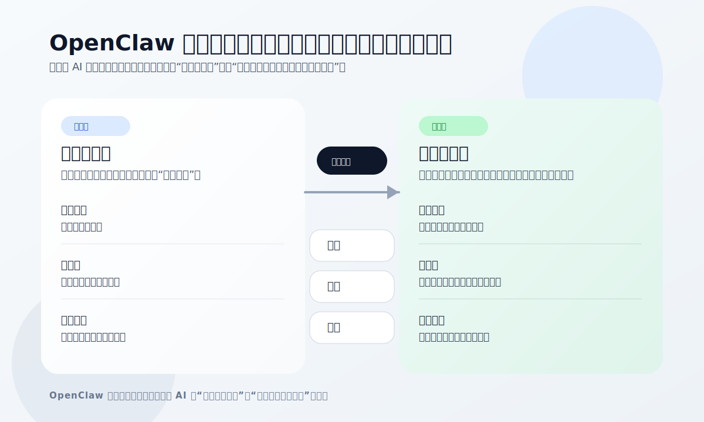
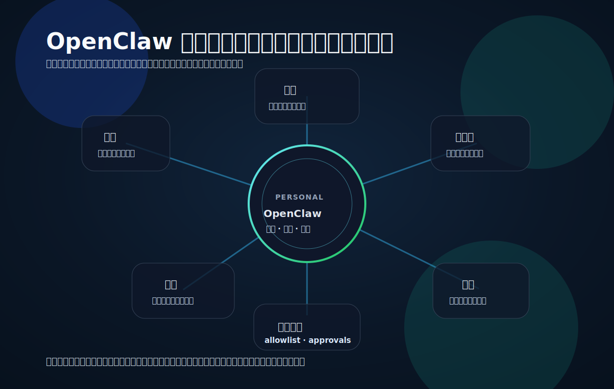

+++
title = 'OpenClaw 不只是聊天机器人，它更像一个人的执行层'
slug = 'openclaw-personal-execution-layer'
date = 2026-03-17T10:30:00+08:00
draft = false
tags = ['OpenClaw', 'AI Agent', 'Personal AI', '趋势观察']
categories = ['AI Tools', 'AI']
summary = '最近几次 OpenClaw 更新让我意识到，真正值得关注的不是它会不会聊，而是它正在把个人 AI 从聊天窗口推向一层常驻、可执行、可控的个人执行系统。'
toc = true
math = false
+++

最近我重新看了一轮 `OpenClaw`，感受和第一次看它时已经完全不同了。

尤其是 2026 年 3 月中旬，它连续发布了 `v2026.3.11`、`v2026.3.12` 和 `v2026.3.13-1` 这些版本之后，我更明显地感觉到：这个项目的重心，已经不是单纯展示“AI 又能干什么”，而是在打磨“AI 怎么长期、稳定、可控地干活”。

第一次看它，很容易把它归到“又一个 AI 助手”里。名字像助手，界面也有对话，于是人会自然地把它理解成一个更本地化、更多工具接入的聊天机器人。

但最近这几次版本更新和官方文档一起看下来，我越来越觉得：**`OpenClaw` 的方向，不是把聊天做得更像人，而是把个人 AI 做得更像一层执行系统。**

但这两者根本不是一回事。

## 为什么我会突然重新重视它

如果只是一个 Demo 型产品，更新节奏通常会围绕“新能力展示”展开，比如又支持了什么模型、又多了什么插件、又能自动生成什么内容。

但 `OpenClaw` 最近释放出来的信号更像是另一种阶段：

- 连续版本更新都在修稳定性和资源问题
- 官方安全文档把权限、配对、允许列表、执行审批写得很靠前
- 官方愿景文档强调的是“连接你的设备、应用、关系和任务”，而不是“给你一个更聪明的聊天窗口”

这说明一件事：它在解决的已经不是“模型能不能回答”，而是**AI 能不能在真实世界里长期驻留、可靠执行、并且不失控**。

这才是个人 AI 产品真正开始变“重”的地方。

## 聊天机器人和执行层，差别到底在哪

聊天机器人解决的是瞬时问题：你问一句，它答一句。

执行层解决的是持续问题：你不在线的时候，它怎么继续理解上下文；你切换设备的时候，它怎么保持状态；它要连接外部工具时，边界怎么划；它真的要执行动作时，谁来负责最后那一下确认。

从这个角度看，`OpenClaw` 更像在做下面四件事。

*图：`OpenClaw` 更值得关注的，不是聊天能力本身，而是它正在从单次会话工具，走向带状态、带工具、带权限边界的个人执行层。*

### 第一，它想成为“常驻入口”，而不是单次会话框

官方 README 直接把它定义成运行在你自己设备上的 personal AI assistant。这句话其实很关键。

“运行在你自己设备上”意味着它不是一个你偶尔打开网页问一句的问题盒子，而是一个有机会长期存在于你个人环境里的系统组件。

一旦产品想长期驻留，它要处理的事情就变了：

- 不只是回答问题，还要管理状态
- 不只是理解 Prompt，还要理解你一天里不断变化的任务
- 不只是给建议，还要决定什么时候该执行、什么时候该停手

所以我会说，它更像“执行层”，而不只是“聊天层”。

### 第二，它的目标不是一个窗口，而是一张连接网

`OpenClaw` 的官方 VISION 写得很直白：它要连接你的应用、文件、沟通对象和日常任务，把这些原本碎裂的入口收束成一个可调度的个人工作界面。

这背后有一个很大的趋势变化。

过去我们使用 AI，往往是“把问题手动搬进聊天框”。文档在别处，任务在别处，消息在别处，浏览器在别处，AI 在另一个标签页里，像一个被动等候召唤的顾问。

而 `OpenClaw` 代表的方向是：**AI 不再待在世界之外，它开始试图进入你的工作流内部。**

这意味着它的价值不再只是“说得好不好”，而是：

- 接得够不够深
- 连得够不够稳
- 状态传递够不够顺
- 动作执行够不够可控

一旦进入这个阶段，产品就很难再靠一个漂亮的聊天界面取胜。

### 第三，真正的门槛变成了“能做事，但不能乱做事”

我很喜欢 `OpenClaw` 的一个信号：它没有回避安全问题，反而把安全问题摆到了台面中央。

在官方 SECURITY 文档里，它明确提到了很多这类产品绕不开的现实问题：

- 本地网关默认只监听 `127.0.0.1`
- 新设备接入需要 pairing
- 有 allowlist 机制限制来源
- 对 shell 等高风险工具设置了额外保护和执行审批

这套语言很重要。它说明团队已经默认一件事：**Agent 不是一个只会说话的东西，而是一个可能真的碰系统、碰数据、碰权限的执行主体。**

一旦它开始触达真实动作，安全就不再是附属说明，而是产品本体的一部分。

换句话说，个人 AI 的下一步，不是让模型更像人，而是让系统更像一个“靠谱的人”：

- 知道自己能做什么
- 知道自己不能做什么
- 知道什么时候该请求确认
- 知道出了问题怎么把损失限制在边界里

### 第四，个人 AI 的价值会从“回答”转向“代办”

我越来越相信，未来很少有人会因为某个 AI “特别会聊天”而长期留在一个产品里。

真正会形成留存的，是另一种能力：

它是否能稳定地帮你处理那些重复、琐碎、跨入口的小任务。

比如：

- 帮你把分散的信息收束成待办
- 帮你在多个上下文之间维持任务连续性
- 帮你把“先提醒我”推进到“帮我执行到哪一步”

这类价值很少在演示视频里显得惊艳，但它更像基础设施。你一旦习惯了，就很难再退回去。

`OpenClaw` 的意义就在这里。它不只是想做一个“你可以问问题的 AI”，而是想做一个“你可以把一部分事情交给它持续处理的 AI”。

这就是执行层的味道。

*图：当 AI 进入文件、终端、消息、浏览器和任务这些真实入口之后，它就不再只是一个聊天框，而更像一层个人运行环境。*

## 为什么这件事会在 2026 年突然变重要

因为模型本身正在变得越来越像一种公共能力。

当底层模型能力逐渐拉平之后，真正拉开差距的，不再只是“谁更会回答”，而是“谁更会组织回答之外的那一整套系统”。

也就是说，竞争焦点开始从模型层往运行层移动：

- 谁更会接入工具
- 谁更会管理上下文
- 谁更会处理权限
- 谁更会控制风险
- 谁更能把 AI 放进真实工作流里

`OpenClaw` 最近让我看到的，正是这种重心迁移。

它最值得关注的地方，不是又新增了多少“能力”，而是它正在把个人 AI 产品推向一种更严肃的形态：**从一个聊天框，变成一个带边界、带连接、带执行能力的个人运行环境。**

## 结语

所以如果今天还把 `OpenClaw` 仅仅看成“一个新的 AI 助手”，那其实已经有点低估它了。

它更像一个信号：个人 AI 的下一阶段，不再是把回答做得更像人，而是把协作做得更像系统。

未来真正重要的问题，可能不再是“AI 懂不懂我”，而是：

**它能不能在我的世界里，长期、可靠、有限度地替我做事。**
